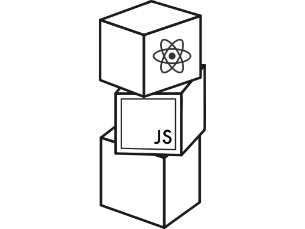

# Fullstack Open Course
<h1 align="center"></h1>
*This repository contains the code from the fullstack open designed by University of Helsinki and Houston Inc.*

[The fullstack open course](https://fullstackopen.com/en/) will introduce the main concepts of modern JavaScript applications, such as React, Redux, Node and TypeScript. And, also will introduce about frontend and backend tests, and, about GraphQL and MongoDB.

## 🗂 Summary
- [Part 1](https://fullstackopen.com/en/part1) 


## 🚀 Getting Started

### 📥 Installing dependencies

Inside the project's folder, run:

```
yarn
```

### 🏎 Running application
Go to the backend folder and run the following command to start the backend server
```
yarn dev:server
```

Go to the frontend folder and run the following command to start the web application
```
yarn start
```


## 🛠 Built With

* [Node](https://nodejs.org/) - JavaScript runtime environment
* [ReactJs](https://reactjs.org/) - A declarative, efficient, and flexible JavaScript library for building user interfaces.
* [Yarn](https://yarnpkg.com/) - Package Manager
* [Express](https://expressjs.com/) - Web framework used NodeJS
* [TypeScript](https://www.typescriptlang.org/) - Typed Superset of JavaScript - used as a development dependency

## 🎖 Author
* **Geraldo Braz** - *Initial work* - [@geraldobraz](https://github.com/geraldobraz)
